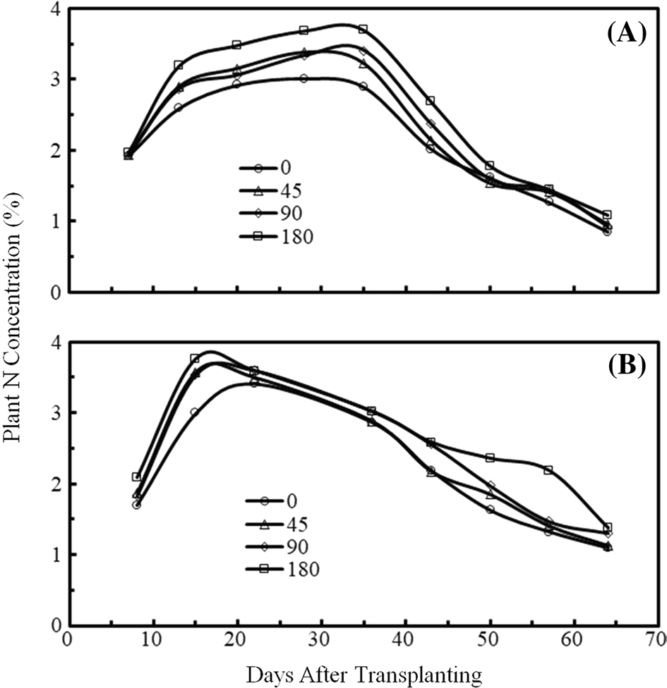

## Estimation of nitrogen status of paddy rice at vegetative phase using unmanned aerial vehicle based multispectral imagery
[TOC]
DAT：day after transplanting
VI：vegetation indices
### 目的：
- 由无人多光谱影像提取玉米波段反射率
- 分析多个植被指数和氮指标在整个vegetation phase的相关性
- 找到与N_Index相关性最大的VI组合和DAT,建立模型，输入参数是VI，DAT，输出参数是N_Index
- 应用模型得到的N_Index，通过采样测SPAD找到，它和样本点SPAD的关系，从N_Index分布图推测整个样地的SPAD分布,知道整块样地的生长状况

### **part1:模型的建立和评估**
一共8块地，每块地分成6份，3份用来建立多个模型，3份用来评估模型,选择模型。
建模：
1. 先找出在总的vegetation phase里，VI和N_index相关系数<0.1的六个植被指数。
2. 再拿这6个指数和N_index去找相关系数>0.5的DAT

3. 但这样找出的6个VI不一定是独立的，可能其中的VI之间有相关性，所以用逐步回归法筛选变量。这样我们找到了很多模型。
4. 检验：逐步回归法可能会过拟合，为此我们需要检验和评估，我们评判模型有很多指标，这篇论文选用 Root mean square error (RMSE)mean bias error (MBE)它们越小说明模型越好，通过这样找出最好的模型。

### **part2模型的具体应用**:

举例应用part1的模型，通过UAV影像处理得到DAT30,45,52时的估计N_index分布图

在N_Index高、中和低的各个地方采样，测得这些样点的用SPAD测量植物生长的叶绿素浓度等类似指标，得到SPAD和N_Index的relationship

然后就可以推算出整个样地的SPAD

The SPAD maps, provide the required information regarding the spatial distribution of nitrogen status in the field and could thus be used as a guide to variable rate application of nitrogen fertilizers by suitable machines (such as drones especially made for fertilization).
在SPAD较低的区域可以人工操作施加氮肥，在SPAD较低的阶段，施加氮肥

The SPAD meter measures the difference between the transmittance of a red (650 nm) and an infrared (940 nm) light through the leaf
### Details
 1. N_content ->N_Index
因为N content不仅受到施肥浓度的影响，随着生长，during the vegetation phase,N content是先增加后减小的，为了找氮含量数据和植被指数的一个不受时期影响的关系，我们找了一个空白对照组，不施氮肥的植物来去掉时间影响。$$
\mathrm{N} \text {-index }=\mathrm{N} \% / \mathrm{N} \%_{\text {ref }}
$$
where N% and N% ref are N content of plants to be evaluated and plants not receiving N
fertilizers, respectively.
first second季节不同，氮含量和两个因素有关：从土壤和肥料中的摄取，光合作用的干物质积累（消耗降低植物氮含量），一开始消耗速率低于吸收速率，消耗速率随着植物生长LAI叶面积指数增加而增加，当消耗速率增加到等于吸收速率时，氮元素含量达到顶峰，开始下降，因为春季吸收速率低于夏季，氮含量达峰的时期春季早于夏季。
先看氮含量随着DAT的变化曲线

 1. Reflectance ->vegetation indices
changes with N treatment(0,45,90,180)(kg N $ha^{-1}$) and DAT(day after transplanting)

3. 二者的关系 
N_Index ——  vegetation indices

多元线性回归选择变量
NDRI ,RECI ,MSAVI, CCVI ,GNDVI逐步回归得到 

### 未来研究
- 建立SPAD和N content的关系
Although the SPAD value is merely a good surrogate for nitrogen status of rice plants, an actual plant nitrogen content map for more precise application rate decisions could be easily created once an operational relationship between SPAD values and plant nitrogen content has been established.
  
- 从氮含量——>叶子的氮浓度
Future work will focus on building such an operational relationship.More studies should also focus on testing the developed model across different varieties and stress levels related to leaf N concentration to improve the robustness and applicability