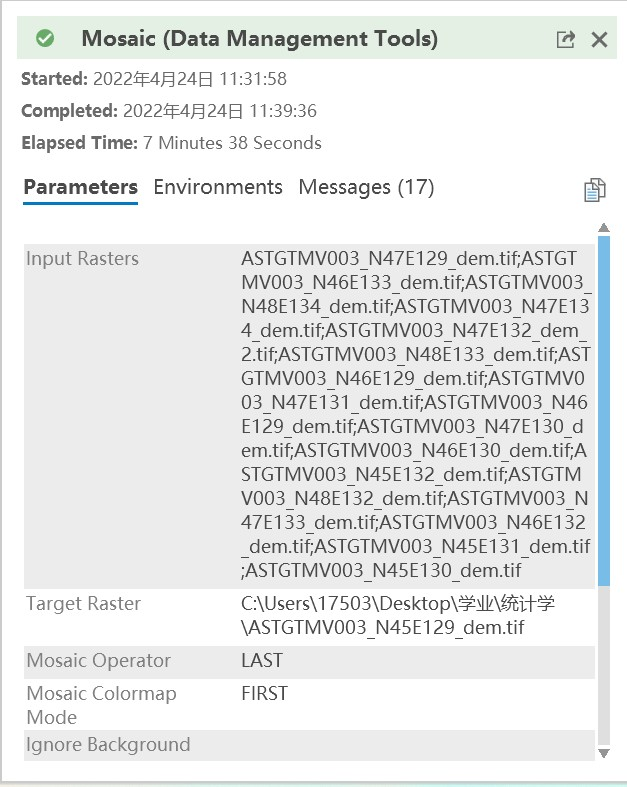

 数据来源：


1. [NASA earthdata搜索网站](https://search.earthdata.nasa.gov/search/)，可以用来查找GDEM数据
   - IDM下载器非常方便[下载](https://www.internetdownloadmanager.cn/download)
   - 举例：N47 E132条带的GDEM数据 https://data.lpdaac.earthdatacloud.nasa.gov/lp-prod-protected/ASTGTM.003/ASTGTMV003_N47E132_dem.tif
      （更改N,E后面数字可以获取其他经纬度的影像）
    -  
2. Worldclim
  [2010-2018年各月降水](https://data.biogeo.ucdavis.edu/data/worldclim/v2.1/base/wc2.1_30s_prec.zip) ，[各月平均温度](https://data.biogeo.ucdavis.edu/data/worldclim/v2.1/base/wc2.1_30s_tavg.zip)
3. 行政区数据来源 
  因为是2021年9月下载的，所以不知道来源，这是文件——[谷歌云盘地址](
  https://drive.google.com/file/d/1ckfxhP74KSR9q2N1sR2lSATJIzFOWfLs/view?usp=sharing)
4. 土壤数据
  由郭笑怡老师提供——[谷歌云盘地址](https://drive.google.com/file/d/1koLqOBiK6T_KUlUT7OzyhThgSBR4HV19/view?usp=sharing)  
  
#### 数据处理分析工具：Arcgis pro

##### 数据处理方法：

Mosaic镶嵌
Extract by Mask
Raster Calculator
Polygon to Raster

 | |
---------|---------|
 Soil data processed by ExtractByMask|Soil data processed by PolygontoRaster|
 ||(valueField=有机质)| 

重分类
[Remap range帮助](https://pro.arcgis.com/zh-cn/pro-app/2.8/arcpy/spatial-analyst/an-overview-of-transformation-classes.htm)
语法
>RemapRange (remapTable)


remapTable:
参数|说明|
---------|----------
[[startValue, endValue, newValue],...] |用于将旧值（按范围指定）重映射为新值的重映射表。    

有机质/%   |全氮/%|全磷/%|全钾/%|坡度|坡向|积温|降水
---------|----------|---------|---------|---------|---------|---------|---------|
[0,2,40] | [0,0.1,50] | [0,0.05,40]|[0,1.5,40]|[0,22.5,50]|[0,2,100]|[0,2000,10]|[0,450,70]
[2,4,50] | [0.1,0.2,60] | [0.05,0.07,50]|[1.5,1.9,50]|[22.5,67.5,60]|[2,6,80]|[2000,2200,30]|[450,500,80]
[4,6,60] | [0.2,0.3,70] | [0.07,0.1,60]|[1.9,2.1,70]|[67.5,112.5,80]|[6,15,60]|[2200,2400,50]|[500,550,90]
[6,8,80]|[0.3,0.4,80]|[0.1,0.15,80]|[2.1,2.5,80]|[112.5,157.5,90]|[15,25,40]|[2400,2600,70]|[550,1000,100]
[8,100,100]|[0.4,0.5,90]|[0.15,100,100]|[2.5,100,100]|[157.5,202.5,100]|[25,90,0]
||[0.5,100,100]|||[202.5,247.5,80]|[2600,4000,90]
| | |||[247.5,292.5,70]
|||||[292.5,337.5,60]
|||||[337.5,360,50]


>remap=RemapRange( [ [0,2,40],[2,4,60],[4,6,80],[8,10,100] ])
Reclassify("in_raster","field",remap)

_一开始我用了个非常lovely的方法:用栅格计算器的条件函数反复嵌套来重分类坡度坡向_
坡度
```
outras=Con("Slope_Extrac1"<=2.0,100,
Con("Slope_Extrac1"<=6.0,80,
Con("Slope_Extrac1"<=15.0,60,
Con("Slope_Extrac1"<=25.0,40,20))))
```
坡向
``` outras=Con( "Aspect_Extra1"<=-1.0,75,
Con("Aspect_Extra1"<=22.5,50,
Con("Aspect_Extra1"<=67.5,60,
Con("Aspect_Extra1"<=112.5,80,
Con("Aspect_Extra1"<=157.5,90,
Con("Aspect_Extra1"<=202.5,100,
Con("Aspect_Extra1"<=247.5,80,
Con("Aspect_Extra1"<=292.5,70,
Con("Aspect_Extra1"<=337.5,60,
Con("Aspect_Extra1"<=360,50,0))))))))))
```
$$
Q_j=\sum_{i=1}^{8}P_{i}\times W_i
$$
$Q_j$是第j个单元的综合得分，$P_i$为第i个指标因子量化得分，W_i是第i个指标因子权重系数，综合指数理论取值范围是[0,100],综合指数越大，单元耕地质量越高。
$$\left[\begin{matrix}
      a_{坡度}& a_{坡向}&a_{积温}&a_{降水}&a_{有机质}&a_{全氮}&a_{全磷}&a_{全钾}\\
      b_{坡度}& b_{坡向}&b_{积温}&b_{降水}&b_{有机质}&b_{全氮}&b_{全磷}&b_{全钾}\\
      &&&…
  \end{matrix}\right]*
\left[
 \begin{matrix}
   坡度 & 0.2 \\
   坡向 & 0.05 \\
   积温 & 0.15\\
   降水 & 0.1\\
   有机质 &0.2\\
   全氮&0.1\\
   全磷&0.1\\
   全钾&0.1\\
  \end{matrix}\right]=\left[\begin{matrix}
      a_{score}\\
      b_{score}\\
      …
  \end{matrix}\right]
$$
