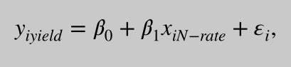

## Determining nitrogen deficiencies for maize using various remote sensing indices
**核心思想**：想要得到某产量，用VI-yeild(植被指数-产量)线性回归方程得到不同时期的VI，将VI和相应的stage代入VI-(stage,N-rate)多元线性回归模型得到N-rate——>N-recommendations
**背景**：
N-rates： are established using two factors:**maize grain yield goal** and **soil texture**. 氮肥的比率，在阿肯色州247 $kg N\cdot  ha^{-1}$是100%，它和土壤质地共同影响最后的产量。换句话说，你可以根据土壤质地和目标产量确定你应该施肥的N_rate

N-recommendations based on conventional systems may not be applicable under the agricultural practices of **no- or minimal tillage**, **winter cover crops** and/or **diverse crop rotations**.这篇论文是在荒地、冬季覆土作物和其他各种各样的轮作上研究 N-recommendation
**研究变量**
  **nitrogen fertilizer rates**
  **maize grain yield**
   **maize growth stage** 
   **vegetation indices**  
 研究N-rate、玉米作物产量、玉米生长时期、植被指数四个变量的关系
 ## 目的：
(i) the **strengths and weaknesses of vegetation indices** in detecting nitrogen fertilizer treatments,
植被指数能不能很好地检测判断N-rate氮肥的施肥方式？
(ii) **the effect of maize growth stage** on the relationship between vegetation index and nitrogen treatment
不同的玉米生长时期对VI和N-rate的关系的影响
或：VI和N-rate的关系随着玉米生长时期的不同有何变化
(iii) the power of vegetation indices for **predicting maize grain yield** during vegetative and reproductive growth stages.
在vegetative和reproductive期间测定的植被指数，能多大程度上预测最终玉米产量。
### **选择maize growth stage** 
选择的玉米生长时期是between the **V6** (six true, collared leaves)and **R4** (dough formation) growth stages
原因：其他阶段不怎么吸收N，中后期植被覆盖和叶子变多，降低了土壤影响。65% of total N-uptake occurs between V6 and vegetative tasseling (VT) Approximately 20% of maize nitrogen demand is satisfied between VT and R3 (milk-like liquid present in kernels)
Vegetative growth stages| |Reproductive growth stages||
------|-------|-------|-------
VE| emergence |R1 |silking
V1| a first leaf| R2 |blister
V2 |second leaf |R3 |milk
V3 |third leaf |R4| dough
V(n)| nth leaf |R5 |dent
VT |tasseling |R6| physiological maturity
## 统计方法 
### 一、线性回归
>Arcgis求每个plot的平均植被指数。

多元线性回归模型（VI-(stage,N-rate)）

$Y_i$ is the index value, $x_{iN−rate}$ is the nitrogen rate and$ x_{istage}$ is the growth stage
简单线性回归：因为stage和VI有较大的相关性，所以下面只是分析VI和N-rate对yield的影响

$y_i$ is the maize grain yield and $x_{iindex}$ is the index value.
### 二、Saturation analysis饱和点分析：
加大N-rate至产量不再变化，这个N-rate就是作物的饱和点，我们需要找到这个饱和点，如果VI和产量在同一N-rate处达到饱和，我们可以用这个VI的饱和点来确定作物的饱和点。

