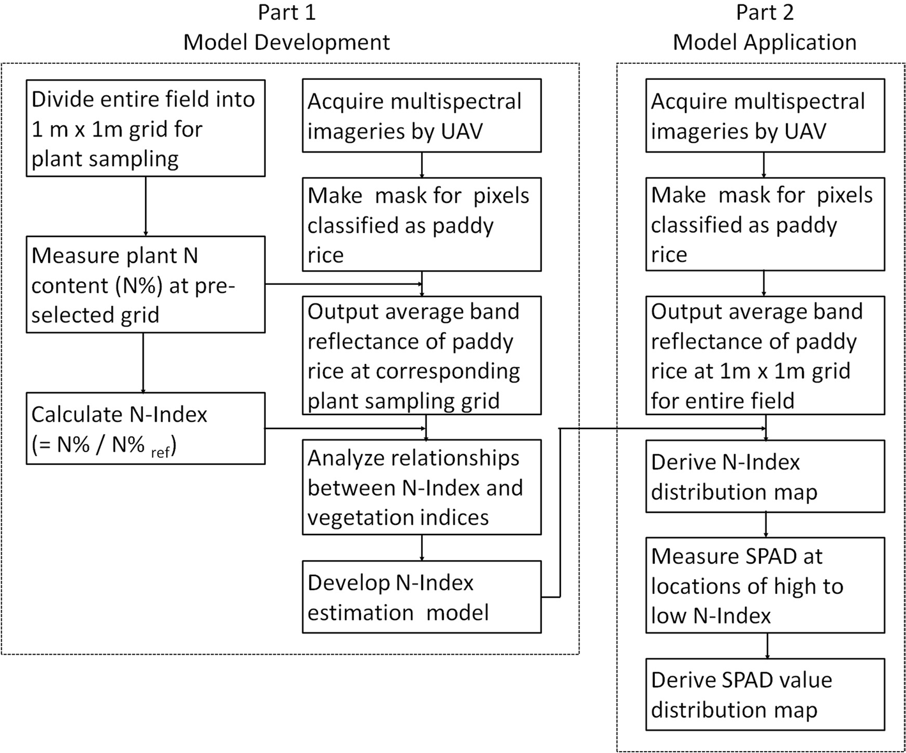
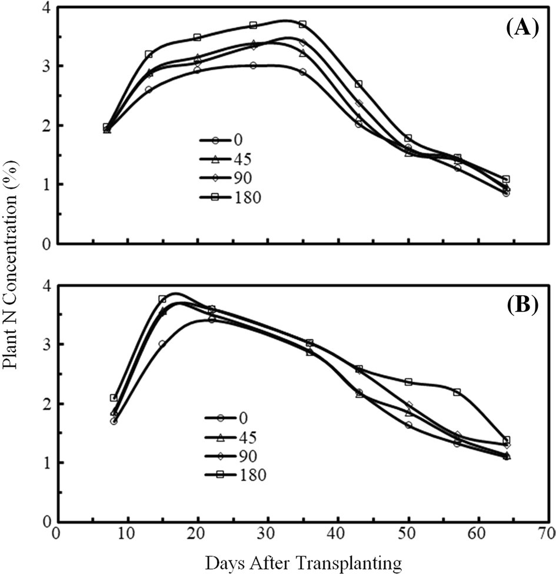
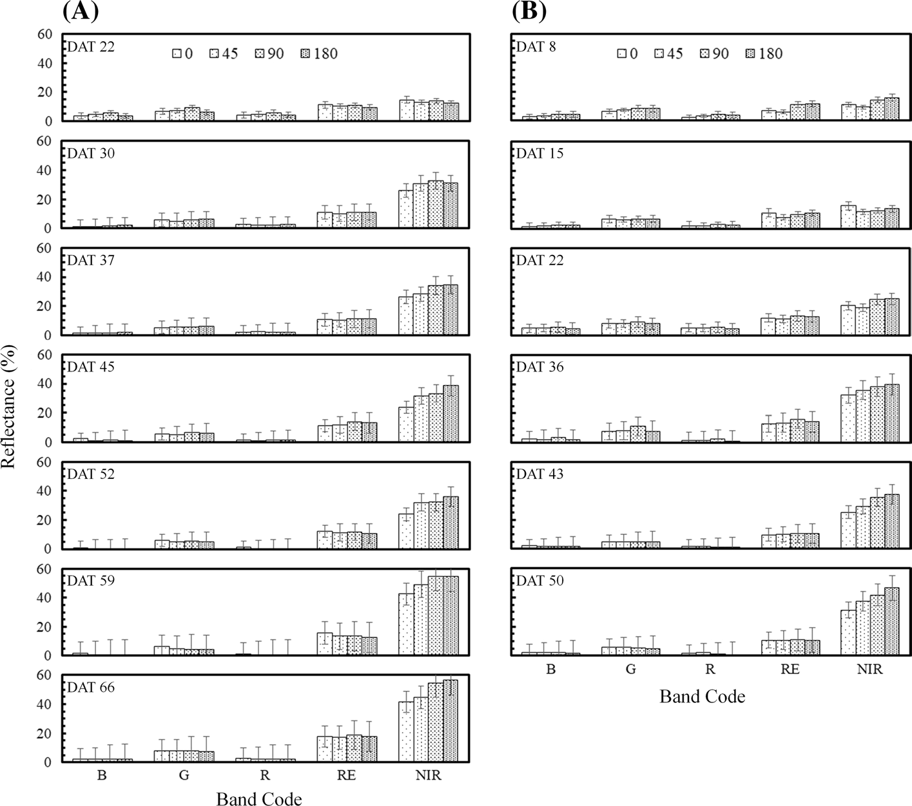

DAT：day after transplanting
VI：vegetation indices
目的：
- 由无人多光谱影像提取玉米波段反射率
- 分析多个植被指数和氮指标在整个vegetation phase的相关性
- 找到与N_Index相关性最大的VI组合和DAT,建立模型，输入参数是VI，DAT，输出参数是N_Index
- 应用模型得到的N_Index，通过采样测SPAD找到，它和样本点SPAD的关系，从N_Index分布图推测整个样地的SPAD分布,知道整块样地的生长状况

### **part1:**
一共8块地，每块地分成6份，3份用来建立多个模型，3份用来评估模型,选择模型。
建模：
1. 先找出在总的vegetation phase里，VI和N_index相关系数<0.1的六个植被指数。
2. 再拿这6个指数和N_index去找相关系数>0.5的DAT

3. 但这样找出的6个VI不一定是独立的，可能其中的VI之间有相关性，所以用逐步回归法筛选变量。这样我们找到了很多模型。
4. 检验：逐步回归法可能会过拟合，为此我们需要检验和评估，我们评判模型有很多指标，这篇论文选用 Root mean square error (RMSE)mean bias error (MBE)它们越小说明模型越好，通过这样找出最好的模型。

### part2:

举例应用part1的模型，通过UAV影像处理得到DAT30,45,52时的估计N_index分布图

在N_Index高、中和低的各个地方采样，测得这些样点的用SPAD测量植物生长的叶绿素浓度等类似指标，得到SPAD和N_Index的relationship

然后就可以推算出整个样地的SPAD

The SPAD maps, provide the required information regarding the spatial distribution of nitrogen status in the field and could thus be used as a guide to variable rate application of nitrogen fertilizers by suitable machines (such as drones especially made for fertilization).
在SPAD较低的区域可以人工操作施加氮肥，在SPAD较低的阶段，施加氮肥

The SPAD meter measures the difference between the transmittance of a red (650 nm) and an infrared (940 nm) light through the leaf
### Details
 1. N_content ->N_Index
因为N content不仅受到施肥浓度的影响，随着生长，during the vegetation phase,N content是先增加后减小的，为了找氮含量数据和植被指数的一个不受时期影响的关系，我们找了一个空白对照组，不施氮肥的植物来去掉时间影响。$$
\mathrm{N} \text {-index }=\mathrm{N} \% / \mathrm{N} \%_{\text {ref }}
$$
where N% and N% ref are N content of plants to be evaluated and plants not receiving N
fertilizers, respectively.
first second季节不同，氮含量和两个因素有关：从土壤和肥料中的摄取，光合作用的干物质积累（消耗降低植物氮含量），一开始消耗速率低于吸收速率，消耗速率随着植物生长LAI叶面积指数增加而增加，当消耗速率增加到等于吸收速率时，氮元素含量达到顶峰，开始下降，因为春季吸收速率低于夏季，氮含量达峰的时期春季早于夏季。
先看氮含量随着DAT的变化曲线

 1. Reflectance ->vegetation indices
changes with N treatment(0,45,90,180)(kg N $ha^{-1}$) and DAT(day after transplanting)

3. 二者的关系 
N_Index ——  vegetation indices

多元线性回归选择变量
NDRI ,RECI ,MSAVI, CCVI ,GNDVI逐步回归得到 

$$
\text { N-Index }=1.188+0.356 \text { RECI }-1.586 \text { NDRI } \quad R^{2}=0.49
$$ 
- 
